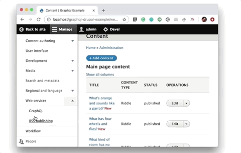
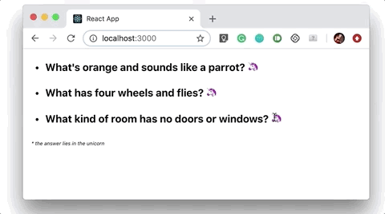

# About this Example.
This is an example of how to implement GraphQL in Drupal 8.
For now the project just exposes it's published node content on the Drupal side and renders it in the React App. It does not do much more than that for now.

What I feel is very important to say is that this example is **using the drupal/graphql module version 3**. Keep it in mind if you are trying just bits of this example or you are comparing it to some other article out on the web.

Further you will find a detailed explanation of how to install and have it up and running on your local machine.

# The Drupal Part



The Drupal instance that is feeding the React App is in the web folder. It's composer file thought is in the root of the porject, so you would run your composer commands from the root folder.

The project is using the GraphQL module, version 8.x-3.

The schema in the context of this version of the module is basically the reflection of the Permissions for the specified Content Types.

How to install it you could find in the Install section further on this page.

# The React App



The Aeact App is in the web-app folder.

All the relevant code is in the web-app/src/App.js and web-app/src/NodesView.js files.

There you could find example with ApolloClient how you could make graphql requests the same way you would do them in the GraphiQL interface inside of Drupal (with the only difference of course that there you are authorized as a Drupal user, so if you can't fetch something from here - check the Drupal Permissions ).

How to install it you could find in the Install section further on this page.

# Installing

## Install composer packages (from the root of the project).
```
composer install
```

## Create an empty database.

## Install Drupal from configuration.
```
cd web/
../vendor/bin/drush site:install --existing-config
```

## If you plan to play with it - save the admin password or keep in mind that "drush uli" exists ;)

## Create some riddle nodes with a drush command that I implemented. (still from the web/ folder)
```
../vendor/bin/drush drupalup_create_content:riddle
```
## Clear Drupal's cache. This registers some of the graphql declarations (still from the web/ folder)
```
../vendor/bin/drush cr
```

## Change the REACT_APP_DRUPAL_URL with [YOUR_DRUPAL_INSTANCE_URL] in web-app/.env (after you create it)
```
cd ../web-app/
cp .env.example .env
nano .env
# Change the value of REACT_APP_DRUPAL_URL
```

## Install node packages. (still from the web-app/ folder)
```
npm install
```

## Start the React application. (still from the web-app/ folder)
```
npm start
```
## Reward your self with a cup of coffee while you are enjoying some riddles ☕
